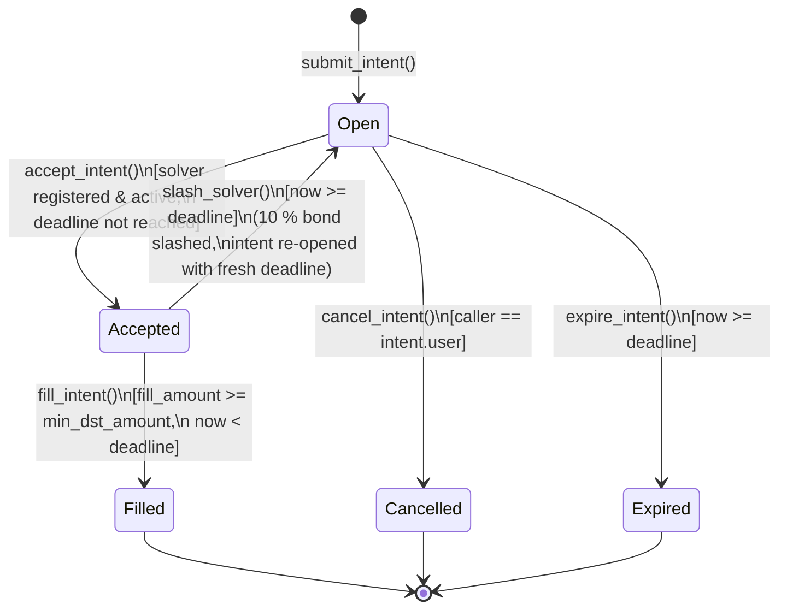

# vortex-contract

**Soroban smart contracts for [Vortex Protocol](https://github.com/vortex-protocol) — intent-based cross-chain swaps settled on Stellar.**

[](https://github.com/vortex-protocol/vortex-contract/actions/workflows/ci.yml)
[](https://codecov.io/gh/vortex-protocol/vortex-contracts)
[](./LICENSE)

This repository holds the on-chain logic that guarantees settlement: intent
lifecycle, solver bonds, and slashing. Part of the multi-repo Vortex stack —
see also [`vortex-backend`](https://github.com/vortex-protocol/vortex-backend)
and [`vortex-frontend`](https://github.com/vortex-protocol/vortex-frontend).

---

## Glossary

| Term | Definition |
|------|------------|
| **Intent** | A user's signed request to swap tokens cross-chain (e.g. "send 1 ETH on Ethereum, receive ≥ 3 500 USDC on Stellar"). An intent carries the source chain/token/amount, the desired destination token, a minimum acceptable output, and a deadline. It does not lock any Stellar funds — the user initiates the source-chain transfer separately. |
| **Solver** | An off-chain market maker that monitors open intents, executes the cross-chain leg, and calls `fill_intent` to settle on Stellar. Solvers must post a USDC bond before they can accept any intent. |
| **Bond** | USDC collateral locked by a solver via `register_solver`. The minimum is 50 USDC (`MIN_BOND`). The bond backs the solver's fill obligation: failing to fill after accepting an intent results in a partial slash. |
| **Fill window** | The time a solver has to deliver output tokens after calling `accept_intent`. Currently 5 minutes (`FILL_WINDOW = 300 s`). If the window expires without a fill, anyone may call `slash_solver` to penalise the solver and re-open the intent. |
| **Slash** | A penalty applied to a solver's bond when they accept an intent but miss the fill window. 10% of the bond is transferred to the fee recipient; the intent reverts to `Open` with a fresh deadline and is re-auctioned. |
| **Intent state** | One of `Open`, `Accepted`, `PartiallyFilled`, `Filled`, `Cancelled`, `Expired`, or `Slashed`. See the lifecycle diagram below for valid transitions. |
| **dst_token** | The destination token on Stellar (a SAC or SEP-41 contract address) that the solver must transfer to the user to settle an intent. |
| **src_chain** | The source blockchain (e.g. `"ethereum"`, `"base"`) where the user is sending funds. Free-text; validated against an optional allowlist. |

---

## Contracts

### `intent_settlement`

Core protocol logic (`intent_settlement/src/lib.rs`):

- `submit_intent()` — user creates a swap intent
- `accept_intent()` — solver claims exclusive fill rights
- `fill_intent()` — solver delivers output tokens to the user
- `cancel_intent()` — user cancels an open intent
- `expire_intent()` — permissionless: materializes an unfilled intent's expiry
- `slash_solver()` — permissionless: slashes a solver that failed to fill
- `register_solver()` / `deregister_solver()` / `withdraw_bond()` — solver bond management
- `propose_fee_recipient()` / `accept_fee_recipient()` — timelocked fee-recipient handover (#115, #116)
- `propose_admin_transfer()` / `accept_admin_transfer()` — timelocked admin-key handover (#115, #116)
- `pause()` / `unpause()` — admin-only incident response
- `propose_add_dst_token()` / `execute_add_dst_token()` / `propose_remove_dst_token()` / `execute_remove_dst_token()` / `set_dst_allowlist_enabled()` — timelocked dst_token allowlist changes (#115, #116, #118)
- `list_allowed_dst_tokens()` — enumerate the full current dst_token allowlist (#117)
- `add_allowed_src_chain()` / `remove_allowed_src_chain()` / `set_src_chain_allowlist_enabled()` — optional src_chain allowlist (#34)
- `rescue_tokens()` — admin-only recovery of non-bond tokens accidentally sent to the contract (#35)
- `propose_upgrade()` / `execute_upgrade()` / `get_pending_upgrade()` / `migrate()` — timelocked in-place contract upgrade + one-time storage-migration hook (#194)
- `set_fee_discount_tiers()` / `get_fee_schedule()` — volume-tier protocol-fee discounts for solvers (#192)

#### Protocol fee & volume-tier discounts (#192)

`fill_intent` charges a protocol fee, paid by the solver, on each fill:

```
fee = fill_amount * effective_fee_bps / 10_000
```

The base rate is `ProtocolConfig.protocol_fee_bps` (default **5 bps = 0.05%**,
admin-tunable via `set_config`, hard-capped at 1 000 bps / 10%).

High-volume solvers can earn a discount on that base rate. The admin sets a
**data-driven discount schedule** — an ordered list of
`(min_volume, discount_bps)` tiers, ascending by `min_volume`:

```bash
# 1M dst-token cumulative volume ⇒ 20% off the fee; 10M ⇒ 50% off.
stellar contract invoke --id <CONTRACT_ID> --source <ADMIN_SECRET_KEY> --network testnet -- \
  set_fee_discount_tiers --tiers '[[10000000000,2000],[100000000000,5000]]'
```

- `discount_bps` is a fraction **of the fee**, in hundredths of a percent
  (`2000` = 20% off, `10000` = fee waived entirely).
- A solver pays the base rate reduced by the highest tier whose `min_volume`
  their cumulative `SolverRecord.total_volume` has reached (`>=`, inclusive).
- The effective rate is always clamped to `0 ..= base` — a discount can never
  make the fee negative or larger than the un-discounted rate.
- With **no schedule set (the default)** every solver pays the flat base rate,
  so this is fully backward-compatible.
- `set_fee_discount_tiers` rejects (`InvalidFeeTiers`) a schedule that isn't
  strictly ascending by `min_volume` or has any `discount_bps > 10 000`. Pass
  an empty list to clear all discounts.
- Solver bots can call `get_fee_schedule(solver)` to read `(tiers,
  effective_fee_bps)` and price a fill before submitting.

#### Usage examples

All examples use the [Stellar CLI](https://developers.stellar.org/docs/tools/developer-tools/cli/stellar-cli)
against a deployed contract. Swap `<CONTRACT_ID>` and `<SECRET_KEY>` for your
deployment; addresses shown are placeholders.

For a complete guide on building an off-chain solver bot (event subscription,
eligibility checks, accept/fill flow), see
[`docs/solver-integration-guide.md`](./docs/solver-integration-guide.md).

```bash
# User submits a swap intent: 1 ETH on Ethereum for at least 3500 USDC on Stellar
stellar contract invoke --id <CONTRACT_ID> --source <SECRET_KEY> --network testnet -- \
  submit_intent \
  --user <USER_ADDRESS> \
  --src_chain '"ethereum"' \
  --src_token '"0xC02aaA39b223FE8D0A0e5C4F27eAD9083C756Cc2"' \
  --src_amount 1000000000000000000 \
  --dst_token <USDC_SAC_ADDRESS> \
  --min_dst_amount 35000000000

# Solver registers with a 50 USDC bond (MIN_BOND)
stellar contract invoke --id <CONTRACT_ID> --source <SOLVER_SECRET_KEY> --network testnet -- \
  register_solver --solver <SOLVER_ADDRESS> --bond_amount 500000000

# Solver claims exclusive fill rights on an intent
stellar contract invoke --id <CONTRACT_ID> --source <SOLVER_SECRET_KEY> --network testnet -- \
  accept_intent --solver <SOLVER_ADDRESS> --intent_id <INTENT_ID>

# Solver delivers the output and closes out the intent
stellar contract invoke --id <CONTRACT_ID> --source <SOLVER_SECRET_KEY> --network testnet -- \
  fill_intent --solver <SOLVER_ADDRESS> --intent_id <INTENT_ID> --fill_amount 35000000000

# Anyone can slash a solver that accepted but missed the fill window
stellar contract invoke --id <CONTRACT_ID> --source <ANY_SECRET_KEY> --network testnet -- \
  slash_solver --intent_id <INTENT_ID>

# Read-only: check current protocol stats
stellar contract invoke --id <CONTRACT_ID> --source <ANY_SECRET_KEY> --network testnet -- \
  get_stats
```

#### Decimal Normalization for `src_amount`

`src_amount` must be expressed in the **source token's smallest indivisible
unit** — the same convention used by the chain's native token representation.
This varies significantly across chains and tokens, so off-chain tooling that
builds `submit_intent` calls must apply the correct multiplier before
submitting.

**General rule:**

```
src_amount = human_amount × 10^decimals
```

**Worked examples:**

| Chain | Token | Decimals | Human amount | `src_amount` value |
|---|---|---|---|---|
| Ethereum | ETH (WETH) | 18 | 1 ETH | `1_000_000_000_000_000_000` |
| Ethereum | USDC | 6 | 500 USDC | `500_000_000` |
| Base | ETH (native) | 18 | 0.5 ETH | `500_000_000_000_000_000` |
| Base | USDC | 6 | 100 USDC | `100_000_000` |
| Polygon | MATIC | 18 | 200 MATIC | `200_000_000_000_000_000_000` |
| Polygon | USDC.e | 6 | 1000 USDC | `1_000_000_000` |
| Avalanche | AVAX | 18 | 10 AVAX | `10_000_000_000_000_000_000` |
| Arbitrum | USDC | 6 | 250 USDC | `250_000_000` |
| BSC | BNB | 18 | 2 BNB | `2_000_000_000_000_000_000` |
| BSC | USDT | 18 | 50 USDT | `50_000_000_000_000_000_000` |

The existing README usage example (`src_amount 1000000000000000000` for
1 ETH on Ethereum) follows this convention.

> **Pitfall — USDC on BSC is 18 decimals**, not 6. Always read the deployed
> contract's `decimals()` function rather than assuming a standard value. Most
> stablecoins on EVM chains are 6 decimals except on BSC, where USDT and BUSD
> are 18.

**On-chain bound:** `src_amount` is stored as `i128`. The contract enforces
`src_amount <= MAX_AMOUNT` (`10^30`), which accommodates amounts up to
one trillion 18-decimal tokens. Any value above this threshold causes
`submit_intent` to return `Error::ZeroAmount` (the generic out-of-range
guard) in the current implementation.

**Stellar side (`min_dst_amount`):** Stellar USDC (Circle's SAC) uses
**7 decimals** (Stellar's native precision). So 3500 USDC on Stellar is
`35_000_000_000` (3500 × 10^7).

```bash
# 1 ETH  → at least 3500 USDC on Stellar
# src_amount:     1 * 10^18 = 1000000000000000000   (ETH, 18 decimals)
# min_dst_amount: 3500 * 10^7 = 35000000000          (USDC SAC, 7 decimals)
stellar contract invoke --id <CONTRACT_ID> --source <SECRET_KEY> --network testnet -- \
  submit_intent \
  --src_chain '"ethereum"' \
  --src_token '"0xC02aaA39b223FE8D0A0e5C4F27eAD9083C756Cc2"' \
  --src_amount 1000000000000000000 \
  --dst_token <USDC_SAC_ADDRESS> \
  --min_dst_amount 35000000000
```

---

#### Intent Lifecycle

The diagram below covers all six `IntentState` variants and the functions that
drive each transition.



> **Note:** `accept_intent` also lazily sets state to `Expired` (and panics)
> when the intent's original deadline has already passed, but this is a
> read-time guard, not a persisted `Open → Expired` path — that explicit
> transition is handled by `expire_intent`.

---

#### Error Reference

The table below maps every `Error` variant to the function(s) that raise it and
the exact condition that triggers it.

| # | Variant | Raised by | Condition |
|---|---------|-----------|-----------|
| 1 | `AlreadyInitialized` | `initialize` | `DataKey::Admin` already exists in instance storage |
| 2 | `Unauthorized` | `fill_intent`, `cancel_intent` | Caller is not the assigned solver / intent owner |
| 3 | `IntentNotFound` | `accept_intent`, `fill_intent`, `cancel_intent`, `slash_solver`, `expire_intent` | No `IntentRecord` found for the supplied `intent_id` |
| 4 | `IntentNotOpen` | `cancel_intent`, `expire_intent` | Intent state is not `Open` |
| 5 | `IntentExpired` | `accept_intent` | `now >= intent.deadline` when a solver tries to accept |
| 6 | `IntentNotAccepted` | `fill_intent`, `slash_solver` | Intent state is not `Accepted` |
| 7 | `SolverNotRegistered` | `accept_intent`, `deregister_solver`, `withdraw_bond` | No `SolverRecord` found for the address |
| 8 | `SolverBondTooLow` | `register_solver`, `withdraw_bond` | Resulting bond total < `MIN_BOND` (50 USDC) |
| 9 | `InsufficientOutput` | `fill_intent` | `fill_amount < intent.min_dst_amount` |
| 10 | `FillWindowExpired` | `fill_intent` | `now >= intent.deadline` (fill window elapsed); also used in `slash_solver` as an inverse guard (window not yet expired) |
| 11 | `CannotCancelAccepted` | `cancel_intent` | Intent state is `Accepted` |
| 12 | `SolverInactive` | `accept_intent` | `solver_record.is_active == false` |
| 13 | `ZeroAmount` | `submit_intent`, `register_solver`, `withdraw_bond` | `src_amount ≤ 0`, `min_dst_amount ≤ 0`, or `bond_amount ≤ 0` |
| 14 | `InvalidDeadline` | `submit_intent` | Supplied `deadline ≤ env.ledger().timestamp()` |
| 15 | `IntentAlreadyFilled` | `fill_intent` | Intent state is `Filled` |
| 16 | `NotInitialized` | `propose_fee_recipient`, `propose_admin_transfer`, `require_admin` | `DataKey::Admin` absent (contract not initialized) |
| 17 | `SolverHasActiveIntents` | `deregister_solver` | `solver_record.active_intents > 0` |
| 18 | `ContractPaused` | `submit_intent`, `accept_intent`, `fill_intent` (via `require_not_paused`) | `DataKey::Paused` is `true` |
| 19 | `DeadlineNotReached` | `expire_intent` | `now < intent.deadline` |
| 20 | `InsufficientBond` | `withdraw_bond` | Requested withdrawal `amount > solver_record.bond_amount` |
| 21 | `DstTokenNotAllowed` | `submit_intent` | `DstAllowlistEnabled` is `true` and `dst_token` is not in the `AllowedDstToken` list |
| 22 | `IntentAlreadyExists` | `submit_intent` | An `IntentRecord` already exists for the derived `intent_id` (hash-collision guard) |
| 23 | `FeeOverflow` | `fill_intent` | `fill_amount * fee_bps` would overflow `i128` |
| 24 | `InvalidTokenInterface` | `propose_add_dst_token` | Candidate address does not implement the SEP-41 `decimals()` probe |
| 25 | `NoPendingFeeRecipient` | `accept_fee_recipient` | No prior `propose_fee_recipient` on record |
| 26 | `SrcChainNotAllowed` | `submit_intent` | src-chain allowlist enforced and `src_chain` not on it (#34) |
| 27 | `RescueProtectedToken` | `rescue_tokens` | Target token is the protocol's own bond token (#35) |
| 28 | `InvalidSrcToken` | `submit_intent` | `src_token` format doesn't match the declared `src_chain`'s convention (#127) |
| 29 | `TimelockNotElapsed` | `accept_fee_recipient`, `accept_admin_transfer`, `execute_add_dst_token`, `execute_remove_dst_token`, `execute_upgrade` | Called before the `#115` timelock delay since the matching `propose_*` call has elapsed |
| 30 | `NoPendingAdminTransfer` | `accept_admin_transfer` | No prior `propose_admin_transfer` on record |
| 31 | `InvalidConfig` | `set_config` | A parameter is outside its allowed bound |
| 32 | `NoPendingDstTokenChange` | `execute_add_dst_token`, `execute_remove_dst_token` | No matching pending proposal for the given token |
| 33 | `AmountTooLarge` | `submit_intent` | `src_amount` or `min_dst_amount` exceeds `MAX_AMOUNT` |
| 34 | `CancelCooldownNotExpired` | `cancel_intent` | Called again before `CANCEL_COOLDOWN` since the caller's last cancellation |
| 35 | `NoPendingUpgrade` | `execute_upgrade` | No prior `propose_upgrade` on record (#194) |
| 36 | `AlreadyMigrated` | `migrate` | Contract is already at `MIGRATION_VERSION` — the one-time guard (#194) |
| 37 | `InvalidFeeTiers` | `set_fee_discount_tiers` | Schedule not strictly ascending by `min_volume`, or a `discount_bps > 10 000` (#192) |

---

### `solver_registry` (planned)

Tiered solver staking with reputation scores. See the roadmap below.

---

## Supported Source Chains

The `src_chain` field in `submit_intent` must use the canonical lowercase string
for the source chain. When `SrcChainAllowlistEnabled` is `true`, only the chains
registered via `add_allowed_src_chain()` are accepted.

| `src_chain` value | Network | Chain type | `src_token` format |
|---|---|---|---|
| `"ethereum"` | Ethereum Mainnet | EVM | `0x` + 40 hex chars (EIP-55 checksum) |
| `"base"` | Base Mainnet | EVM L2 | `0x` + 40 hex chars |
| `"polygon"` | Polygon PoS | EVM | `0x` + 40 hex chars |
| `"arbitrum"` | Arbitrum One | EVM L2 | `0x` + 40 hex chars |
| `"optimism"` | OP Mainnet | EVM L2 | `0x` + 40 hex chars |
| `"avalanche"` | Avalanche C-Chain | EVM | `0x` + 40 hex chars |
| `"bsc"` | BNB Smart Chain | EVM | `0x` + 40 hex chars |
| `"solana"` | Solana Mainnet Beta | SVM | base58 mint address *(planned)* |

For the full token address reference (contract addresses, decimals per chain,
and allowlist management commands) see
[docs/132-supported-chains.md](./docs/132-supported-chains.md).

> **Decimal reminder:** EVM tokens use 18 decimals for native assets and
> typically 6 for stablecoins — except on BSC where USDT and USDC are 18
> decimals. Always verify via the token contract's `decimals()` call. See the
> [Decimal Normalization](#decimal-normalization-for-src_amount) section above.

---

## Build & Test

### Prerequisites

- Rust 1.78+ with the `wasm32-unknown-unknown` target
- [Stellar CLI](https://developers.stellar.org/docs/tools/developer-tools/cli/stellar-cli)
- [GNU Make](https://www.gnu.org/software/make/) or [`just`](https://just.systems/) (optional shortcuts)

### Shortcut commands (recommended)

A `Makefile` and `justfile` are provided at the repo root so you can run the
full pre-push check with a single command:

```bash
make all          # fmt + lint + test + build
# or, with just:
just all
```

Individual targets:

```bash
make fmt          # cargo fmt --all
make lint         # cargo clippy --all-targets -- -D warnings
make test         # cargo test
make build        # cargo build --target wasm32-unknown-unknown --release
make help         # list all targets
```

### Raw commands

If you prefer to run commands directly (or don't have Make/just installed):

```bash
cd intent_settlement
cargo fmt --all
cargo clippy --all-targets -- -D warnings
cargo test
stellar contract build
```

### Deploy (testnet)

Using the Makefile shortcut:

```bash
export STELLAR_SOURCE=<SECRET_KEY>
make deploy-testnet
# or:
just deploy-testnet STELLAR_SOURCE=<SECRET_KEY>
```

Or run the raw command directly:
#### Automated (recommended)

A config-driven script handles the build, deploy, and `initialize()` call in
one step, reducing copy-paste errors across repeated deployments.

```bash
# 1. Create your config file (only needs to be done once)
cp deploy-testnet.env.example deploy-testnet.env
$EDITOR deploy-testnet.env          # fill in admin, fee_recipient, bond_token, secret key

# 2. Deploy + initialize
./deploy-testnet.sh

# 3. Skip the build if the wasm is already built
./deploy-testnet.sh --skip-build
```

The script saves the deployed contract ID to `.last-deploy-testnet` for
reference. See `deploy-testnet.env.example` for all available options.

#### Manual

```bash
stellar contract deploy \
  --wasm intent_settlement/target/wasm32-unknown-unknown/release/vortex_intent_settlement.wasm \
  --source <SECRET_KEY> \
  --network testnet
```

For a step-by-step mainnet promotion checklist (initialize parameters, bond
token verification, post-deploy sanity checks, rollback procedures), see
[`docs/mainnet-deployment-runbook.md`](./docs/mainnet-deployment-runbook.md).
### Reproducible build verification

Independently verify that your local build matches a deployed contract's
on-chain binary (supply-chain integrity check):

```bash
# Print the SHA-256 of the locally-built wasm
./verify-build.sh

# Compare against a deployed contract
./verify-build.sh <CONTRACT_ID>
```

The script pins the Rust toolchain version, cleans prior artifacts, and
rebuilds with `--locked` to ensure a deterministic output. See comments
inside `verify-build.sh` for the full list of reproducibility settings.

---

## Security Model

Settlement relies on two primitives:

1. **Solver bonds** — solvers lock USDC to participate. Failed fills slash 10% of
   their bond, making repeated failures unprofitable.
2. **Fill-window enforcement** — once a solver accepts, the intent is locked for
   5 minutes. If they fail to fill, the intent reverts to `open` and is
   re-auctioned, and the bond is slashed permissionlessly via `slash_solver()`.

### Pause scope (issue #36)

`pause()` halts `submit_intent`, `accept_intent`, `fill_intent`, **and** the
solver bond management functions (`register_solver`, `deregister_solver`,
`withdraw_bond`). The rationale:

- During a live incident an admin needs to freeze the full protocol state to
  investigate. Allowing solvers to withdraw bonds while paused would let them
  shed collateral exactly when the protocol needs it most as a backstop.
- `slash_solver()` remains **permissionless and unpauseable** — a solver who
  already accepted an intent cannot dodge accountability by waiting out the
  pause.
- `cancel_intent()` remains **open during a pause** — users should always be
  able to reclaim their Open intents without needing admin cooperation.

### Destination token allowlist default (issue #37)

`is_dst_allowlist_enabled` defaults to **`false`** on a fresh deployment,
meaning `submit_intent` accepts any `dst_token` address until an admin opts in.

**Pre-launch action required:** before going live on mainnet, call
`propose_add_dst_token()` for every supported output token, wait out the
timelock delay (#115), then call `execute_add_dst_token()` followed by
`set_dst_allowlist_enabled(true)` to enforce validation. This prevents users
from accidentally targeting an unsupported or malicious token contract, and
gives them a window to notice the allowlist change before it takes effect.
Call `list_allowed_dst_tokens()` at any time to see the full current
allowlist (#117).

The same pattern applies to the **source-chain allowlist** (`is_src_chain_allowlist_enabled`,
also off by default). Call `add_allowed_src_chain()` for every supported source
chain (e.g. `"ethereum"`, `"base"`, `"polygon"`), then enable enforcement with
`set_src_chain_allowlist_enabled(true)`.

To report a vulnerability, see the org
[SECURITY.md](https://github.com/vortex-protocol/.github/blob/main/SECURITY.md).
For the detailed threat model specific to `intent_settlement`, see
[SECURITY.md](./SECURITY.md) in this repository.

---

## Intent ID Derivation

Off-chain solver tooling that needs to predict or verify intent IDs can use the
exact preimage scheme documented here.

**Intent ID is a SHA-256 hash of a collision-resistant preimage.** The preimage
is built by concatenating (in order):

1. **User Address** — XDR-encoded Stellar account address
2. **Source Chain** — XDR-encoded string (e.g., `"ethereum"`, `"polygon"`)
3. **Source Amount** — 8 bytes, big-endian i128 (two's complement signed integer)
4. **Timestamp** — 8 bytes, big-endian u64 (unsigned integer, seconds since Unix epoch)

**Hash function:** `SHA-256(preimage)` → 32-byte intent ID

This scheme ensures two otherwise-identical intents from different users or chains
never collide. See [`compute_intent_id()`](./intent_settlement/src/lib.rs#L889)
for the reference implementation.

### Example (pseudocode)

```python
import hashlib

def compute_intent_id(user_address: str, src_chain: str, src_amount: int, timestamp: int) -> bytes:
    preimage = b''
    preimage += xdr_encode_address(user_address)
    preimage += xdr_encode_string(src_chain)
    preimage += src_amount.to_bytes(8, 'big', signed=True)
    preimage += timestamp.to_bytes(8, 'big', signed=False)
    return hashlib.sha256(preimage).digest()
```

---

## Roadmap

- [x] **Contract test suite** — `soroban_sdk` testutils coverage for the full intent
      lifecycle, solver bonding/slashing, admin controls, pause, and storage TTL
      management
- [ ] **Solver registry contract** — tiered staking, reputation NFT, dispute resolution
- [ ] **Cross-chain proof verification** — verify source-chain tx on-chain via Stellar oracle / messaging infra

---

## Contributing

See the repo-specific [`CONTRIBUTING.md`](./CONTRIBUTING.md) for Rust/Soroban
toolchain setup, test conventions, and PR requirements. For org-wide process,
see the org-wide
[CONTRIBUTING.md](https://github.com/vortex-protocol/.github/blob/main/CONTRIBUTING.md).
See [CONTRIBUTING.md](./CONTRIBUTING.md) for contributor and maintainer
guidelines, including local dev commands, the pre-push checklist, and the
branch-protection / required-checks maintainer guide.

For org-wide policies see the
[org CONTRIBUTING.md](https://github.com/vortex-protocol/.github/blob/main/CONTRIBUTING.md).

## License

[MIT](./LICENSE) © 2025–2026 Vortex Protocol Contributors
