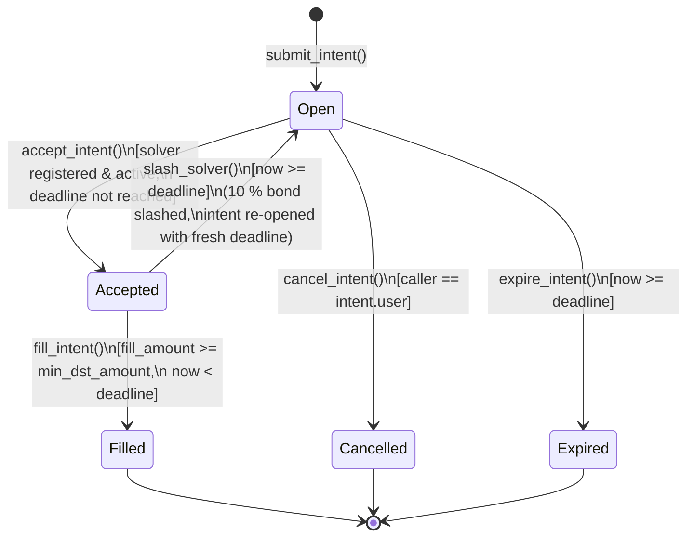

# vortex-contract

**Soroban smart contracts for [Vortex Protocol](https://github.com/vortex-protocol) — intent-based cross-chain swaps settled on Stellar.**

[](https://github.com/vortex-protocol/vortex-contract/actions/workflows/ci.yml)
[](./LICENSE)

This repository holds the on-chain logic that guarantees settlement: intent
lifecycle, solver bonds, and slashing. Part of the multi-repo Vortex stack —
see also [`vortex-backend`](https://github.com/vortex-protocol/vortex-backend)
and [`vortex-frontend`](https://github.com/vortex-protocol/vortex-frontend).

---

## Glossary

| Term | Definition |
|------|------------|
| **Intent** | A user's signed request to swap tokens cross-chain (e.g. "send 1 ETH on Ethereum, receive ≥ 3 500 USDC on Stellar"). An intent carries the source chain/token/amount, the desired destination token, a minimum acceptable output, and a deadline. It does not lock any Stellar funds — the user initiates the source-chain transfer separately. |
| **Solver** | An off-chain market maker that monitors open intents, executes the cross-chain leg, and calls `fill_intent` to settle on Stellar. Solvers must post a USDC bond before they can accept any intent. |
| **Bond** | USDC collateral locked by a solver via `register_solver`. The minimum is 50 USDC (`MIN_BOND`). The bond backs the solver's fill obligation: failing to fill after accepting an intent results in a partial slash. |
| **Fill window** | The time a solver has to deliver output tokens after calling `accept_intent`. Currently 5 minutes (`FILL_WINDOW = 300 s`). If the window expires without a fill, anyone may call `slash_solver` to penalise the solver and re-open the intent. |
| **Slash** | A penalty applied to a solver's bond when they accept an intent but miss the fill window. 10% of the bond is transferred to the fee recipient; the intent reverts to `Open` with a fresh deadline and is re-auctioned. |
| **Intent state** | One of `Open`, `Accepted`, `PartiallyFilled`, `Filled`, `Cancelled`, `Expired`, or `Slashed`. See the lifecycle diagram below for valid transitions. |
| **dst_token** | The destination token on Stellar (a SAC or SEP-41 contract address) that the solver must transfer to the user to settle an intent. |
| **src_chain** | The source blockchain (e.g. `"ethereum"`, `"base"`) where the user is sending funds. Free-text; validated against an optional allowlist. |

---

## Contracts

### `intent_settlement`

Core protocol logic (`intent_settlement/src/lib.rs`):

- `submit_intent()` — user creates a swap intent
- `accept_intent()` — solver claims exclusive fill rights
- `fill_intent()` — solver delivers output tokens to the user
- `cancel_intent()` — user cancels an open intent
- `expire_intent()` — permissionless: materializes an unfilled intent's expiry
- `slash_solver()` — permissionless: slashes a solver that failed to fill
- `register_solver()` / `deregister_solver()` / `withdraw_bond()` — solver bond management
- `set_fee_recipient()` / `transfer_admin()` — admin key management
- `pause()` / `unpause()` — admin-only incident response
- `add_allowed_dst_token()` / `remove_allowed_dst_token()` / `set_dst_allowlist_enabled()` — optional dst_token allowlist
- `add_allowed_src_chain()` / `remove_allowed_src_chain()` / `set_src_chain_allowlist_enabled()` — optional src_chain allowlist (#34)
- `rescue_tokens()` — admin-only recovery of non-bond tokens accidentally sent to the contract (#35)

#### Usage examples

All examples use the [Stellar CLI](https://developers.stellar.org/docs/tools/developer-tools/cli/stellar-cli)
against a deployed contract. Swap `<CONTRACT_ID>` and `<SECRET_KEY>` for your
deployment; addresses shown are placeholders.

```bash
# User submits a swap intent: 1 ETH on Ethereum for at least 3500 USDC on Stellar
stellar contract invoke --id <CONTRACT_ID> --source <SECRET_KEY> --network testnet -- \
  submit_intent \
  --user <USER_ADDRESS> \
  --src_chain '"ethereum"' \
  --src_token '"0xC02aaA39b223FE8D0A0e5C4F27eAD9083C756Cc2"' \
  --src_amount 1000000000000000000 \
  --dst_token <USDC_SAC_ADDRESS> \
  --min_dst_amount 35000000000

# Solver registers with a 50 USDC bond (MIN_BOND)
stellar contract invoke --id <CONTRACT_ID> --source <SOLVER_SECRET_KEY> --network testnet -- \
  register_solver --solver <SOLVER_ADDRESS> --bond_amount 500000000

# Solver claims exclusive fill rights on an intent
stellar contract invoke --id <CONTRACT_ID> --source <SOLVER_SECRET_KEY> --network testnet -- \
  accept_intent --solver <SOLVER_ADDRESS> --intent_id <INTENT_ID>

# Solver delivers the output and closes out the intent
stellar contract invoke --id <CONTRACT_ID> --source <SOLVER_SECRET_KEY> --network testnet -- \
  fill_intent --solver <SOLVER_ADDRESS> --intent_id <INTENT_ID> --fill_amount 35000000000

# Anyone can slash a solver that accepted but missed the fill window
stellar contract invoke --id <CONTRACT_ID> --source <ANY_SECRET_KEY> --network testnet -- \
  slash_solver --intent_id <INTENT_ID>

# Read-only: check current protocol stats
stellar contract invoke --id <CONTRACT_ID> --source <ANY_SECRET_KEY> --network testnet -- \
  get_stats
```

#### Intent Lifecycle

The diagram below covers all six `IntentState` variants and the functions that
drive each transition.



> **Note:** `accept_intent` also lazily sets state to `Expired` (and panics)
> when the intent's original deadline has already passed, but this is a
> read-time guard, not a persisted `Open → Expired` path — that explicit
> transition is handled by `expire_intent`.

---

#### Error Reference

The table below maps every `Error` variant to the function(s) that raise it and
the exact condition that triggers it.

| # | Variant | Raised by | Condition |
|---|---------|-----------|-----------|
| 1 | `AlreadyInitialized` | `initialize` | `DataKey::Admin` already exists in instance storage |
| 2 | `Unauthorized` | `fill_intent`, `cancel_intent` | Caller is not the assigned solver / intent owner |
| 3 | `IntentNotFound` | `accept_intent`, `fill_intent`, `cancel_intent`, `slash_solver`, `expire_intent` | No `IntentRecord` found for the supplied `intent_id` |
| 4 | `IntentNotOpen` | `cancel_intent`, `expire_intent` | Intent state is not `Open` |
| 5 | `IntentExpired` | `accept_intent` | `now >= intent.deadline` when a solver tries to accept |
| 6 | `IntentNotAccepted` | `fill_intent`, `slash_solver` | Intent state is not `Accepted` |
| 7 | `SolverNotRegistered` | `accept_intent`, `deregister_solver`, `withdraw_bond` | No `SolverRecord` found for the address |
| 8 | `SolverBondTooLow` | `register_solver`, `withdraw_bond` | Resulting bond total < `MIN_BOND` (50 USDC) |
| 9 | `InsufficientOutput` | `fill_intent` | `fill_amount < intent.min_dst_amount` |
| 10 | `FillWindowExpired` | `fill_intent` | `now >= intent.deadline` (fill window elapsed); also used in `slash_solver` as an inverse guard (window not yet expired) |
| 11 | `CannotCancelAccepted` | `cancel_intent` | Intent state is `Accepted` |
| 12 | `SolverInactive` | `accept_intent` | `solver_record.is_active == false` |
| 13 | `ZeroAmount` | `submit_intent`, `register_solver`, `withdraw_bond` | `src_amount ≤ 0`, `min_dst_amount ≤ 0`, or `bond_amount ≤ 0` |
| 14 | `InvalidDeadline` | `submit_intent` | Supplied `deadline ≤ env.ledger().timestamp()` |
| 15 | `IntentAlreadyFilled` | `fill_intent` | Intent state is `Filled` |
| 16 | `NotInitialized` | `set_fee_recipient`, `transfer_admin`, `require_admin` | `DataKey::Admin` absent (contract not initialized) |
| 17 | `SolverHasActiveIntents` | `deregister_solver` | `solver_record.active_intents > 0` |
| 18 | `ContractPaused` | `submit_intent`, `accept_intent`, `fill_intent` (via `require_not_paused`) | `DataKey::Paused` is `true` |
| 19 | `DeadlineNotReached` | `expire_intent` | `now < intent.deadline` |
| 20 | `InsufficientBond` | `withdraw_bond` | Requested withdrawal `amount > solver_record.bond_amount` |
| 21 | `DstTokenNotAllowed` | `submit_intent` | `DstAllowlistEnabled` is `true` and `dst_token` is not in the `AllowedDstToken` list |

---

### `solver_registry` (planned)

Tiered solver staking with reputation scores. See the roadmap below.

---

## Build & Test

### Prerequisites

- Rust 1.78+ with the `wasm32-unknown-unknown` target
- [Stellar CLI](https://developers.stellar.org/docs/tools/developer-tools/cli/stellar-cli)

```bash
cd intent_settlement
cargo fmt --all
cargo clippy --all-targets -- -D warnings
cargo test
stellar contract build
```

### Deploy (testnet)

```bash
stellar contract deploy \
  --wasm target/wasm32-unknown-unknown/release/vortex_intent_settlement.wasm \
  --source <SECRET_KEY> \
  --network testnet
```

---

## Security Model

Settlement relies on two primitives:

1. **Solver bonds** — solvers lock USDC to participate. Failed fills slash 10% of
   their bond, making repeated failures unprofitable.
2. **Fill-window enforcement** — once a solver accepts, the intent is locked for
   5 minutes. If they fail to fill, the intent reverts to `open` and is
   re-auctioned, and the bond is slashed permissionlessly via `slash_solver()`.

### Pause scope (issue #36)

`pause()` halts `submit_intent`, `accept_intent`, `fill_intent`, **and** the
solver bond management functions (`register_solver`, `deregister_solver`,
`withdraw_bond`). The rationale:

- During a live incident an admin needs to freeze the full protocol state to
  investigate. Allowing solvers to withdraw bonds while paused would let them
  shed collateral exactly when the protocol needs it most as a backstop.
- `slash_solver()` remains **permissionless and unpauseable** — a solver who
  already accepted an intent cannot dodge accountability by waiting out the
  pause.
- `cancel_intent()` remains **open during a pause** — users should always be
  able to reclaim their Open intents without needing admin cooperation.

### Destination token allowlist default (issue #37)

`is_dst_allowlist_enabled` defaults to **`false`** on a fresh deployment,
meaning `submit_intent` accepts any `dst_token` address until an admin opts in.

**Pre-launch action required:** before going live on mainnet, call
`add_allowed_dst_token()` for every supported output token, then call
`set_dst_allowlist_enabled(true)` to enforce validation. This prevents users
from accidentally targeting an unsupported or malicious token contract.

The same pattern applies to the **source-chain allowlist** (`is_src_chain_allowlist_enabled`,
also off by default). Call `add_allowed_src_chain()` for every supported source
chain (e.g. `"ethereum"`, `"base"`, `"polygon"`), then enable enforcement with
`set_src_chain_allowlist_enabled(true)`.

To report a vulnerability, see the org
[SECURITY.md](https://github.com/vortex-protocol/.github/blob/main/SECURITY.md).
For the detailed threat model specific to `intent_settlement`, see
[SECURITY.md](./SECURITY.md) in this repository.

---

## Roadmap

- [x] **Contract test suite** — `soroban_sdk` testutils coverage for the full intent
      lifecycle, solver bonding/slashing, admin controls, pause, and storage TTL
      management
- [ ] **Solver registry contract** — tiered staking, reputation NFT, dispute resolution
- [ ] **Cross-chain proof verification** — verify source-chain tx on-chain via Stellar oracle / messaging infra

---

## Contributing

See the org-wide
[CONTRIBUTING.md](https://github.com/vortex-protocol/.github/blob/main/CONTRIBUTING.md).

## License

[MIT](./LICENSE) © 2025–2026 Vortex Protocol Contributors
